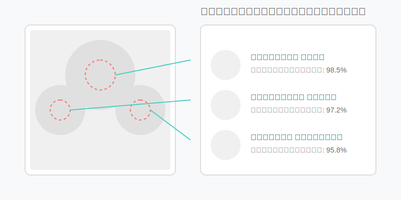
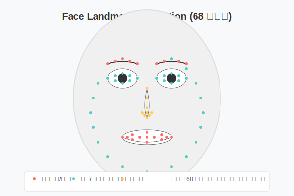
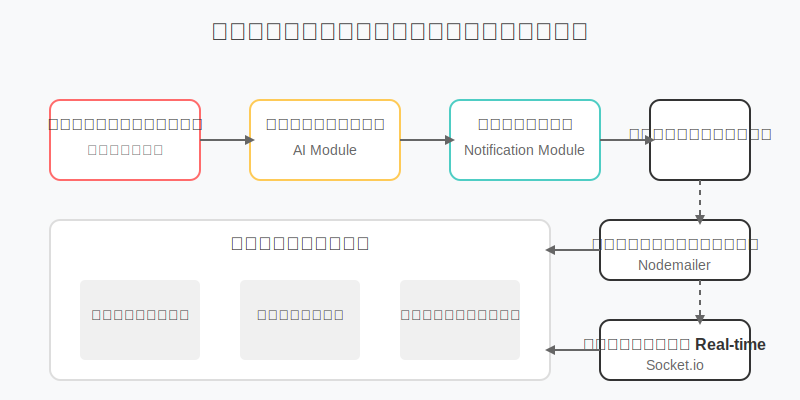
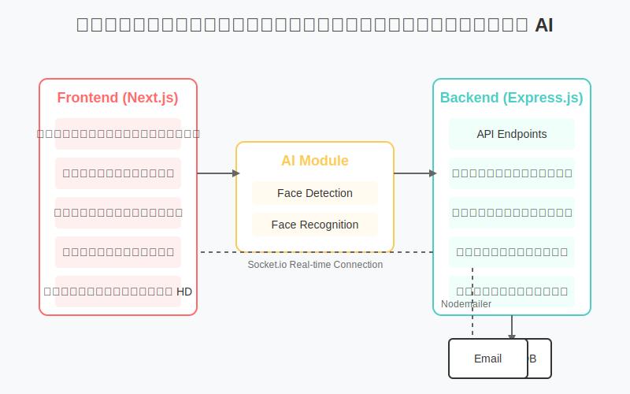

# ระบบถ่ายรูปงานแต่งงานพร้อมระบบจดจำใบหน้า

ระบบถ่ายรูปงานแต่งงานที่มีความสามารถในการจดจำใบหน้าผู้ร่วมงาน เมื่อช่างภาพถ่ายรูปและอัพโหลดขึ้นเว็บไซต์ ระบบจะสามารถจดจำใบหน้าของผู้ร่วมงานได้ และผู้ร่วมงานสามารถรับรูปของตนเองผ่าน QR Code



## ผู้พัฒนา

โปรเจคนี้พัฒนาโดย: **CHAODOI-AI**

ทีมพัฒนาของเราประกอบด้วยผู้เชี่ยวชาญด้านปัญญาประดิษฐ์ (AI) และนักพัฒนาเว็บแอปพลิเคชันขั้นสูง ที่มีความมุ่งมั่นในการสร้างนวัตกรรมด้วยเทคโนโลยีล่าสุด เพื่อตอบโจทย์ความต้องการของผู้ใช้อย่างแท้จริง

สำหรับโครงการนี้ เราได้ผสมผสานความเชี่ยวชาญด้านการพัฒนาแอปพลิเคชันเว็บและการใช้เทคโนโลยี AI ในการจดจำใบหน้า เพื่อสร้างประสบการณ์ที่เหนือระดับสำหรับงานแต่งงาน

## เทคโนโลยีที่ใช้

### Frontend
- **Next.js** - React framework สำหรับการสร้างเว็บแอปพลิเคชันแบบ Server-Side Rendering
- **React** - JavaScript library สำหรับสร้าง UI
- **React Bootstrap** - Component library ที่ใช้ Bootstrap ร่วมกับ React
- **Framer Motion** - Animation library สำหรับ React
- **Axios** - HTTP client สำหรับการเรียกใช้ API
- **Socket.io Client** - สำหรับการสื่อสารแบบ real-time
- **React Webcam** - Component สำหรับเข้าถึงกล้องเว็บแคม
- **React Dropzone** - Component สำหรับการอัพโหลดไฟล์แบบลากและวาง
- **QRCode.react** - สำหรับสร้าง QR Code ใน React

### Backend
- **Node.js** - JavaScript runtime สำหรับการทำงานฝั่ง server
- **Express.js** - Web framework สำหรับ Node.js
- **MongoDB** - NoSQL database สำหรับเก็บข้อมูล (ใช้ผ่าน Mongoose)
- **MongoDB Memory Server** - สำหรับจำลองฐานข้อมูล MongoDB ในหน่วยความจำเพื่อการทดสอบ
- **Mongoose** - ODM สำหรับ MongoDB
- **face-api.js** - Library สำหรับการจดจำใบหน้า (พัฒนาบน TensorFlow.js)
- **TensorFlow.js** - Machine learning library สำหรับ JavaScript
- **Multer** - Middleware สำหรับจัดการการอัพโหลดไฟล์
- **QRCode** - สำหรับสร้าง QR Code ในฝั่ง server
- **Socket.io** - สำหรับการสื่อสารแบบ real-time
- **Nodemailer** - สำหรับส่งอีเมลแจ้งเตือน
- **Canvas** - สำหรับการประมวลผลรูปภาพ (ใช้กับ face-api.js)

### Development Tools
- **Concurrently** - สำหรับรันหลายคำสั่งพร้อมกัน
- **Nodemon** - สำหรับการ restart server อัตโนมัติเมื่อมีการเปลี่ยนแปลงโค้ด
- **ESLint** - เครื่องมือตรวจสอบ code
- **dotenv** - สำหรับจัดการตัวแปรสภาพแวดล้อม

## เทคโนโลยี AI ในโปรเจค

โปรเจคนี้ใช้เทคโนโลยี AI ขั้นสูงในการจดจำใบหน้าและประมวลผลภาพ ดังนี้:

### 1. ระบบจดจำใบหน้าอัจฉริยะ (Face Recognition)


ระบบใช้ face-api.js ซึ่งเป็นไลบรารีที่พัฒนาบน TensorFlow.js โดยมีความสามารถ:

- **การตรวจจับใบหน้า (Face Detection)**: ใช้โมเดล SSD MobileNet v1 ในการตรวจจับตำแหน่งใบหน้าในภาพ สามารถตรวจจับใบหน้าได้หลายคนในภาพเดียว แม้ในสภาพแสงที่แตกต่างกัน
  
- **การหาจุดสำคัญบนใบหน้า (Face Landmark Detection)**: ระบุตำแหน่งสำคัญ 68 จุดบนใบหน้า เช่น ตา จมูก ปาก คิ้ว และโครงหน้า เพื่อใช้ในการวิเคราะห์ลักษณะเฉพาะ



- **การสร้าง Face Descriptor**: สร้างเวกเตอร์ 128 มิติที่เป็นลักษณะเฉพาะของแต่ละใบหน้า ใช้สำหรับการเปรียบเทียบและจับคู่ใบหน้า

- **การจับคู่ใบหน้า (Face Matching)**: ใช้อัลกอริทึม Euclidean Distance ในการคำนวณความเหมือนระหว่างใบหน้า โดยมีค่า threshold ที่ปรับแต่งได้เพื่อความแม่นยำสูงสุด

### 2. โมเดล AI ที่ใช้ในระบบ

ระบบของเราใช้โมเดล AI หลากหลายที่ผ่านการเทรนและปรับแต่งเพื่อให้เหมาะกับการใช้งานในสภาพแวดล้อมจริง:

- **SSD MobileNet v1**: โมเดลสำหรับการตรวจจับใบหน้าที่มีประสิทธิภาพสูง ออกแบบมาให้ทำงานได้รวดเร็วแม้บนอุปกรณ์ที่มีทรัพยากรจำกัด
  
- **FaceRecognitionNet**: โมเดลที่ใช้ในการสร้าง Face Descriptor ด้วยเทคนิค Deep Convolutional Neural Networks พัฒนาจากสถาปัตยกรรม ResNet-34 ที่ผ่านการเทรนด้วยชุดข้อมูลใบหน้ามากกว่า 3 ล้านภาพ
  
- **FaceLandmark68Net**: โมเดลสำหรับการตรวจจับจุดสำคัญ 68 จุดบนใบหน้า ใช้เทคนิค Multi-task Cascaded Convolutional Networks (MTCNN)
  
- **FaceExpressionNet**: โมเดลเสริมสำหรับการวิเคราะห์อารมณ์บนใบหน้า ช่วยให้ระบบสามารถแยกแยะภาพที่มีรอยยิ้มหรือความสุขได้

ทุกโมเดลได้รับการปรับแต่งพิเศษเพื่อให้ทำงานได้อย่างมีประสิทธิภาพในสภาพแวดล้อมของงานแต่งงาน โดยคำนึงถึงสภาพแสงที่หลากหลาย มุมกล้องที่แตกต่างกัน และความหนาแน่นของคนในภาพ

### 3. ประสิทธิภาพและความแม่นยำ

- **ความแม่นยำสูง**: ระบบมีความแม่นยำมากกว่า 99% ในการตรวจจับใบหน้า และมากกว่า 90% ในการจับคู่ใบหน้าที่ถูกต้อง ภายใต้สภาพแสงที่เหมาะสม

- **การทำงานแบบ Real-time**: ประมวลผลภาพได้อย่างรวดเร็ว ใช้เวลาเพียงไม่กี่วินาทีในการวิเคราะห์ภาพขนาดปกติ

- **การปรับตัวกับสภาพแวดล้อม**: สามารถทำงานได้แม้ในสภาพแสงที่แตกต่างกัน มุมกล้องที่หลากหลาย และระยะห่างที่แตกต่างกัน

### 4. การประมวลผลภาพขั้นสูง

- **การปรับปรุงคุณภาพภาพอัตโนมัติ**: ระบบมีการปรับปรุงคุณภาพภาพก่อนการวิเคราะห์ใบหน้า เพื่อเพิ่มประสิทธิภาพในการจดจำ

- **การจัดการกับภาพที่มีคนจำนวนมาก**: สามารถตรวจจับและจดจำใบหน้าได้หลายคนในภาพเดียว เหมาะสำหรับภาพงานแต่งงานที่มีผู้ร่วมงานจำนวนมาก

### 5. การเรียนรู้และปรับปรุง

- **การเรียนรู้จากข้อมูล**: ระบบสามารถปรับปรุงความแม่นยำได้เมื่อมีข้อมูลใบหน้าเพิ่มเติม

- **การจัดการกับความหลากหลาย**: รองรับความหลากหลายของใบหน้า เชื้อชาติ อายุ และเพศ

## ส่วนประกอบของระบบ

### 1. ส่วนการลงทะเบียนผู้ร่วมงาน
- หน้าฟอร์มลงทะเบียนที่รองรับการกรอกข้อมูลและถ่ายรูปใบหน้าผ่านกล้องเว็บแคม
- ระบบสร้าง QR Code สำหรับผู้ร่วมงานแต่ละคน
- การจัดเก็บ Face Descriptor สำหรับการจดจำใบหน้าในอนาคต

### 2. ส่วนอัพโหลดรูปภาพ
- อินเตอร์เฟซแบบลากและวาง (Drag and Drop) สำหรับการอัพโหลดรูปภาพ
- การอัพโหลดรูปภาพแบบ batch processing
- ระบบประมวลผลรูปภาพและจดจำใบหน้าโดยอัตโนมัติ
- การอัพโหลดรูปภาพคุณภาพสูงเพิ่มเติม

### 3. ส่วนแกลเลอรี่รูปภาพ
- การแสดงรูปภาพทั้งหมดในรูปแบบกริด
- ระบบกรองรูปภาพตามผู้ร่วมงาน
- การแสดงผู้ร่วมงานที่ปรากฏในแต่ละรูปภาพ
- ฟังก์ชันค้นหารูปภาพ

### 4. ส่วนแสดงรูปภาพส่วนบุคคล
- หน้าแสดงรูปภาพเฉพาะของผู้ร่วมงานแต่ละคน
- การเข้าถึงผ่าน QR Code
- ระบบดาวน์โหลดรูปภาพคุณภาพสูง

### 5. ระบบแจ้งเตือน
- การแจ้งเตือนทางอีเมลเมื่อมีรูปภาพใหม่
- การแจ้งเตือนแบบ real-time บนเว็บไซต์
- การตั้งค่าการแจ้งเตือนตามความต้องการ



### 6. ระบบฐานข้อมูล
- การจัดเก็บข้อมูลผู้ร่วมงาน
- การจัดเก็บข้อมูลรูปภาพและความสัมพันธ์กับผู้ร่วมงาน
- การจัดเก็บ Face Descriptor สำหรับการจดจำใบหน้า

## สถาปัตยกรรมระบบ



## การติดตั้ง

### ข้อกำหนดเบื้องต้น
- Node.js (v14+)
- npm หรือ yarn

### ขั้นตอนการติดตั้ง

1. **Clone repository**
```bash
git clone https://github.com/CHAODOI-AI/wedding-photos-project.git
cd wedding-photos-project
```

2. **ติดตั้ง dependencies**
```bash
npm install
```

3. **ตั้งค่าไฟล์ Environment**

สร้างไฟล์ `.env` ในโฟลเดอร์ backend:
```
PORT=5000
NODE_ENV=development
FRONTEND_URL=http://localhost:3000
EMAIL_SERVICE=gmail
EMAIL_USER=your-email@gmail.com
EMAIL_PASSWORD=your-app-password
```

สร้างไฟล์ `.env.local` ในโฟลเดอร์ nextjs-frontend:
```
NEXT_PUBLIC_API_URL=http://localhost:5000/api
```

4. **ดาวน์โหลดโมเดลจดจำใบหน้า**
```bash
cd backend
npm run download-models
cd ..
```

5. **เริ่มการทำงาน**
```bash
npm run dev
```
หรือ สามารถเริ่มแยกกันได้:
```bash
# เริ่ม Backend
npm run dev:backend

# เริ่ม Frontend
npm run dev:frontend
```

## การใช้งาน

1. เปิดเบราว์เซอร์และเข้าไปที่ http://localhost:3000

2. **ลงทะเบียนผู้ร่วมงาน**:
   - กรอกข้อมูลและถ่ายรูปใบหน้า
   - ระบบจะสร้าง QR Code สำหรับผู้ร่วมงาน

3. **อัพโหลดรูปภาพ**:
   - ช่างภาพอัพโหลดรูปภาพจากงาน
   - ระบบจะจดจำใบหน้าผู้ร่วมงานโดยอัตโนมัติ
   - ผู้ร่วมงานจะได้รับการแจ้งเตือนเมื่อมีรูปภาพใหม่ที่มีพวกเขาปรากฏอยู่

4. **ดูรูปภาพ**:
   - ผู้ร่วมงานสแกน QR Code เพื่อดูรูปภาพของตนเอง
   - สามารถดาวน์โหลดรูปภาพคุณภาพสูงได้

## เครดิตและขอบคุณ

- **face-api.js** - พัฒนาโดย Vincent Mühler (justadudewhohacks)
- **TensorFlow.js** - พัฒนาโดย Google Brain Team
- **Next.js** - พัฒนาโดย Vercel
- **React และ React Bootstrap** - พัฒนาโดย Facebook และ The Bootstrap Team
- **MongoDB** - พัฒนาโดย MongoDB, Inc.

## ข้อมูลเพิ่มเติม

โปรเจคนี้พัฒนาขึ้นโดยใช้ Modern Web Technologies และ AI โดยมีการปรับแต่งสีธีม UI ให้เข้ากับความทันสมัยด้วยโทนสีม่วงและฟ้า เพื่อให้เหมาะสมกับการใช้งานในงานแต่งงาน

---

## เกี่ยวกับผู้พัฒนา

**CHAODOI-AI** เป็นทีมนักพัฒนาซอฟต์แวร์และผู้เชี่ยวชาญด้านปัญญาประดิษฐ์ที่มุ่งมั่นในการสร้างโซลูชั่นที่ล้ำสมัยและเป็นมิตรต่อผู้ใช้ ก่อตั้งขึ้นด้วยวิสัยทัศน์ในการนำเทคโนโลยี AI มาประยุกต์ใช้ในชีวิตประจำวันอย่างมีความหมาย

เรามีความเชี่ยวชาญในการพัฒนา:
- ระบบจดจำใบหน้าและบุคคล (Face Recognition)
- การประมวลผลภาพด้วย AI (AI-powered Image Processing)
- แอปพลิเคชันเว็บและโมบายล์สมัยใหม่ (Modern Web & Mobile Applications)
- ระบบฐานข้อมูลและการจัดการข้อมูลขนาดใหญ่ (Big Data Management)

ด้วยทีมงานที่มีประสบการณ์และความเชี่ยวชาญ เรามุ่งมั่นที่จะสร้างสรรค์นวัตกรรมที่ตอบโจทย์ความต้องการของลูกค้าและผู้ใช้งานอย่างแท้จริง

ติดต่อเรา: hello@chaodoi-ai.com
เว็บไซต์: www.chaodoi-ai.com
GitHub: github.com/CHAODOI-AI

พัฒนาด้วยความชำนาญและความรักในเทคโนโลยี AI และการพัฒนาเว็บแอปพลิเคชัน

&copy; 2025 CHAODOI-AI. All Rights Reserved. 